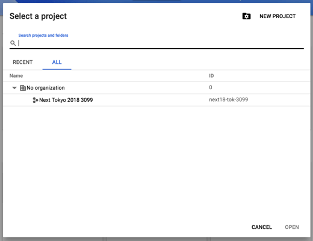
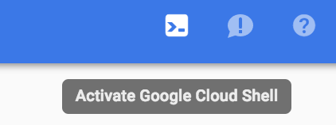
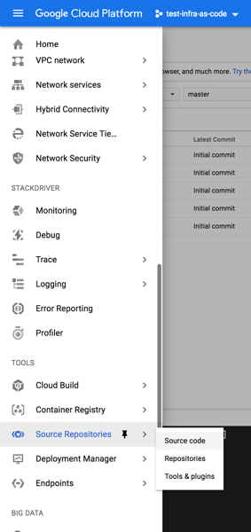
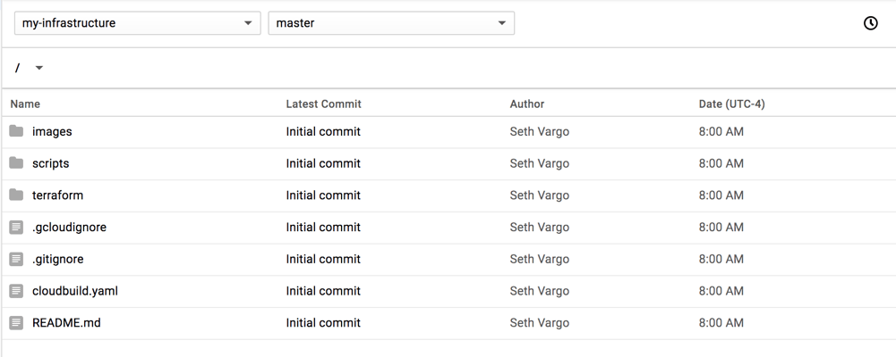
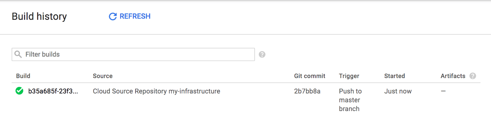
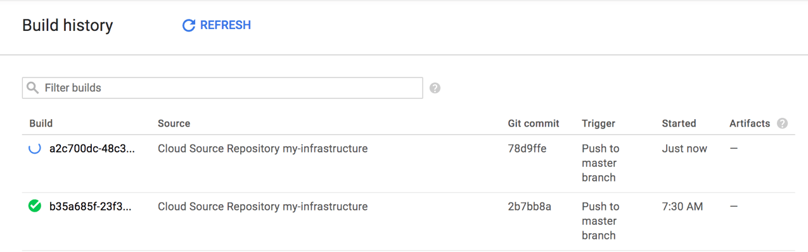
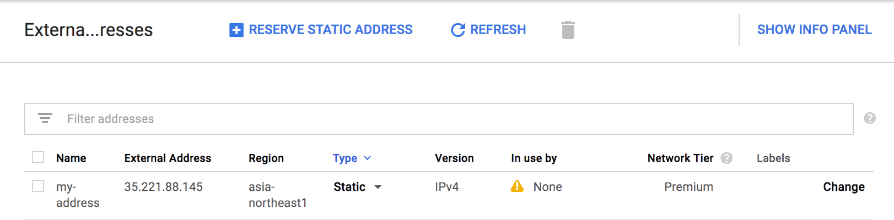

# Infrastructure as Code Workshop

This interactive, step-by-step workshop teaches you how to use HashiCorp
[Terraform][terraform], [Google Cloud Source Repositories][gcpsr], and
[Google Cloud Build][gcpb] to manage Infrastructure as Code on
[Google Cloud Platform][gcp].

**Goals**

- No local system modification or installation - runs entirely in [Google Cloud Shell][gcpcs]
- Push-to-git to provision Infrastructure as Code
- Share and collaborate on code

**Requirements**

- A modern browser, such as Chrome, Firefox, or Safari
- An active [Google Cloud][gcp] account (one may be provided for Google-sponsored sessions)


## Lab Setup

In this section, you will connect to [Google Cloud Shell][gcpcs] using your
browser, download the lab materials, and install prerequisite software.

1. Connect to the Google Cloud Console by visiting
https://console.cloud.google.com in your browser.

    **If you were provided credentials** as part of a Google-sponsored session,
    please use an [incognito window][chrome-incognito] or log out of your
    existing Google account, and then authenticate with the provided credentials.

1. Choose your project from the project picker

    

    

1. Launch Google Cloud Shell by clicking on the terminal icon in the blue
header on the top-right portion of the screen as shown below:

    

    If this is your first time opening Cloud Shell, it may take a minute to
    provision. You can learn more about Cloud Shell in the
    [Cloud Shell documentation][gcpcs].

1. Download and extract the lab materials inside your Cloud Shell. The materials
include initial configurations, some helpful shell scripts, and this README:

    ```text
    $ curl -sSfLo master.zip https://github.com/sethvargo/infra-as-code-workshop/archive/master.zip
    ```

    ```text
    $ unzip master.zip
    ```

    ```text
    $ cd infra-as-code-workshop-master
    ```

    These are the lab materials we will use today.

1. Install and configure [Terraform][terraform]. Terraform is the tool this workshop uses for managing Infrastructure as Code.

    ```text
    $ ./scripts/00-install-terraform.sh
    ```

    This script performs the following operations:

    - Downloads and installs Terraform using
      [sethvargo/hashicorp-installer][hashicorp-installer], which verifies the
      download can be trusted by validating the GPG signatures

    - Installs Terraform auto-completions (tab completions)

    - Creates a [Google Cloud Storage][gcpstorage] bucket for Terraform to persist
      its state; we use a storage bucket so that Terraform's state is available to
      Google Cloud Build later

    - Configures Terraform to talk to the bucket

1. Verify that Terraform is installed and available:

    ```text
    $ terraform -v
    Terraform v0.11.8 (or similar output)
    ```


## GKE Cluster

In this section, you will provision a [Google Kubernetes Engine][gcpgke] (GKE)
with Terraform.

1. Enable the necessary APIs in your project. By default, projects do not have
any services enabled. This script uses [gcloud][gcloud] to enable the necessary
APIs and services on your project. This only needs to be done once per project,
but enabling a service is idempotent (it is safe to run multiple times).

    ```text
    $ ./scripts/01-enable-services.sh
    ```

    Note: Enabling services is asynchronous and can take up to 5 minutes.

1. Change into the `terraform` directory. This is where you will execute
Terraform.

    ```text
    $ cd terraform
    ```

1. Inspect the `main.tf` file and see how easy it is to provision a GKE cluster
with Terraform.

    ```hcl
    resource "google_container_cluster" "my-cluster" {
      # ...
    }
    ```

    Terraform reads this file and creates the cluster, if it does not already
    exist.

1. Run `terraform init` to initialize Terraform. Terraform will download the
necessary configurations to be able to communicate with Google Cloud.

    ```text
    $ terraform init
    ```

1. Run `terraform apply` to show the changes and prompt for approval.

    ```text
    $ terraform apply
    ```

    ```text
    Plan: 1 to add, 0 to change, 0 to destroy.
    Do you want to perform these actions?
      Terraform will perform the actions described above.
      Only 'yes' will be accepted to approve.

      Enter a value: []
    ```

    **If you get an error** like the following, it means the services have not
    yet been enabled. Wait a few minutes and try again.

    ```text
    Google Compute Engine: Access Not Configured. Compute Engine API has not been used in project before or it is disabled. Enable it by visiting...
    ```

1. Approve these changes. Terraform will now make the necessary API calls to
Google Cloud Platform to provision the GKE cluster with the given parameters.

    When prompted, answer:

    ```text
    yes
    ```

    Note: This is creating a GKE cluster, which can take up to 5 minutes. Please
    be patient and do not cancel the operation.


## Cloud Source Repository

In this section, you will use Terraform create a [Google Cloud Source
Repository][gcpsr]. You will then commit and push these Terraform configurations
into that repository. It is possible to create a Google Cloud Source Repository
without using Terraform, but what fun would that be?

Source control is an important piece of Infrastructure as Code, as it enables a
history of changes and collaboration. This workshop uses Google Cloud Source
Repositories, but you could easily use another source control tool like GitHub,
GitLab, etc.

**Please make sure you are in the `terraform` directory before continuing.**

1. Open the `repo.tf` file and uncomment the `google_source_repository`
resource.

    ```text
    resource "google_sourcerepo_repository" "my-infrastructure" {
      name = "my-infrastructure"
    }
    ```

    This snippet instructs Terraform to create a Google Cloud Source Repository
    named "my-infrastructure" in the current project.

1. Run `terraform apply` to plan these changes.

    ```text
    $ terraform apply
    ```

    When prompted, answer "yes" to apply the changes.

    ```text
    Terraform will perform the following actions:
      + google_sourcerepo_repository.my-infrastructure
          id:      <computed>
          name:    "my-infrastructure"
          project: <computed>
          size:    <computed>
          url:     <computed>
    Plan: 1 to add, 0 to change, 0 to destroy.
    Do you want to perform these actions?
      Terraform will perform the actions described above.
      Only 'yes' will be accepted to approve.

      Enter a value: yes
    ```

1. Configure git to push changes to this new source repository.

    ```text
    $ ../scripts/02-setup-git.sh
    ```

    If you have not used Git on this project before, you will also be prompted
    to enter your name and email address. This is for authoring commits.

1. Push your changes to Cloud Source Repositories using the standard Git
commands.

    ```text
    git push -u origin master
    ```

1. View the source repository in the Google Cloud Console by navigating to
"Source Repositories" in the sidebar and choosing "Source code" from the menu.

    

    


## Cloud Build

In this section, you will enable and configure [Google Cloud Build][gcpb].

1. Configure Cloud Build with permissions to run Terraform on our behalf.

    ```text
    $ ../scripts/03-configure-cloud-build.sh
    ```

    This script will grant the Cloud Build service account the ability to
    execute Terraform on our behalf and access the data stored by Terraform in
    the Google Cloud Storage bucket.

1. Push our code to Cloud Build. This uses the `cloudbuild.yaml` file to
configure Google Cloud Build and executes Terraform on our behalf.

    ```text
    $ ../scripts/04-submit-build.sh
    ```

1. Inspect the log stream output and see the familiar output as when you were
running Terraform locally. This is running Terraform as part of a CI/CD process now:

    ```text
    # ...

    Step #0: Terraform has been successfully initialized!
    Step #0:
    Step #0: You may now begin working with Terraform. Try running "terraform plan" to see
    Step #0: any changes that are required for your infrastructure. All Terraform commands
    Step #0: should now work.
    Step #0:
    Step #0: If you ever set or change modules or backend configuration for Terraform,
    Step #0: rerun this command to reinitialize your working directory. If you forget, other
    Step #0: commands will detect it and remind you to do so if necessary.
    Finished Step #0
    Starting Step #1
    Step #1: Already have image (with digest): hashicorp/terraform:0.11.8
    Step #1: google_sourcerepo_repository.my-infrastructure: Refreshing state... (ID: repos/my-infrastructure)
    Step #1: google_container_cluster.my-cluster: Refreshing state... (ID: my-cluster-2)
    Step #1:
    Step #1: Apply complete! Resources: 0 added, 0 changed, 0 destroyed.
    Finished Step #1
    PUSH
    DONE
    ```


## Cloud Build Trigger

In this section, you will connect these Terraform configurations to [Google
Cloud Build][gcpb] so that changes committed in git automatically execute
Terraform.

The goal is to have CI/CD for your Terraform configurations. When you commit new
changes to your source repository, Terraform will automatically run via Cloud
Build.

1. Create a build trigger so that changes in the Cloud Source Repository via git
trigger a new build in Google Cloud Build.

    ```text
    $ ../scripts/05-create-trigger.sh
    ```

1. Verify the setup is correct by committing all your changes. When you push
these changes, it will trigger a Google Cloud Build.

    ```text
    git commit --allow-empty -m "Add cloud build trigger"
    git push
    ```

1. Verify the build was successful (no changes) by visiting Google Cloud Build in the Google Cloud Console.

    


## Make Changes

In this section, you will make changes to the source which will trigger real
infrastructure changes.

We will be allocating a public IP address using Infrastructure as Code.

1. Open the `main.tf` file and add the following block of code. This code
instructs Terraform to create a public IP address.

    ```hcl
    resource "google_compute_address" "default" {
      name   = "my-address"
      region = var.region
    }
    ```

1. Commit the changes to source and push the changes to the repository. This
will trigger Cloud Build to run Terraform and apply the changes.

    ```text
    $ git add .
    ```

    ```text
    $ git commit -m "Create address"
    ```

    ```text
    $ git push
    ```

1. Verify the build completes successfully in the Google Cloud Console building
visiting the Cloud Build page.

    

1. See that the public IP address was created successfully by clicking on VPC
Networks -> External Addresses in the sidebar.

    

    or run the gcloud command to list addresses:

    ```text
    $ gcloud compute addresses list
    NAME        REGION           ADDRESS         STATUS
    my-address  asia-northeast1  1.2.3.4         RESERVED
    ```


## Destroy (Optional)

In this section, you will destroy all the infrastructure you created. This is
optional.

1. Execute Terraform:

    ```text
    $ terraform destroy
    ```

    When prompted, answer

    ```text
    yes
    ```


## License

```text
Copyright 2018-2020 Seth Vargo
Copyright 2018-2020 Google, Inc.

Licensed under the Apache License, Version 2.0 (the "License");
you may not use this file except in compliance with the License.
You may obtain a copy of the License at

    http://www.apache.org/licenses/LICENSE-2.0

Unless required by applicable law or agreed to in writing, software
distributed under the License is distributed on an "AS IS" BASIS,
WITHOUT WARRANTIES OR CONDITIONS OF ANY KIND, either express or implied.
See the License for the specific language governing permissions and
limitations under the License.
```

[hashicorp-installer]: https://github.com/sethvargo/hashicorp-installer
[terraform]: https://www.terraform.io/
[gcp]: https://cloud.google.com/
[gcpgke]: https://cloud.google.com/kubernetes-engine/
[gcpsr]: https://cloud.google.com/source-repositories
[gcpstorage]: https://cloud.google.com/storage
[gcpb]: https://cloud.google.com/cloud-build
[gcpcs]: https://cloud.google.com/shell
[gcloud]: https://cloud.google.com/sdk
[chrome-incognito]: https://support.google.com/chrome/answer/95464?co=GENIE.Platform%3DDesktop&hl=en
